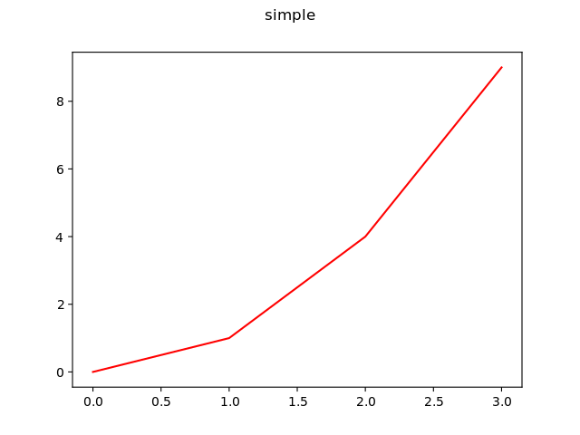
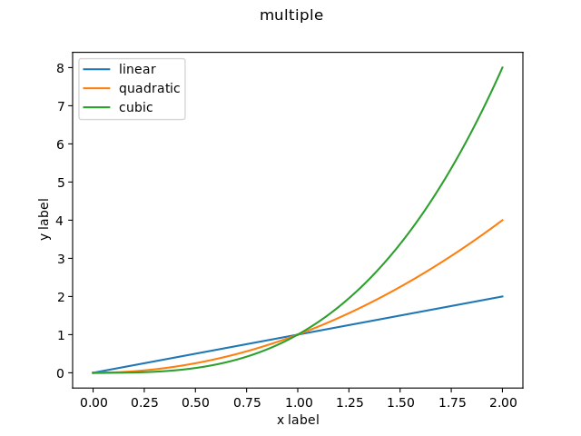
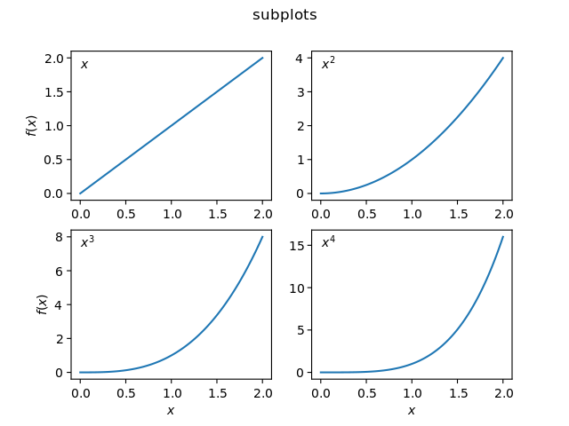
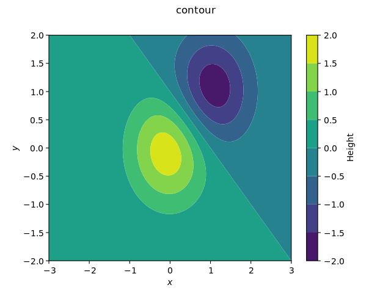
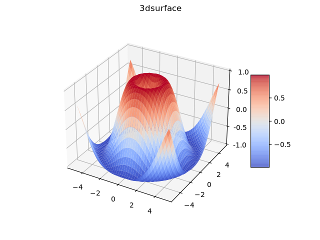

# mplot-pybind
Graph plotting from `C++` using python's `matplotlib` via `pybind11`.

## Introduction

This repository describes my experience with plotting graphs from c++ using
[pybind11](https://github.com/pybind/pybind11) to access python's
[`matplotlib`](https://matplotlib.org/).  It includes some examples and a small,
header-only, `c++` library of things I've found useful. 

The included examples show how to construct each of the plots shown below in
`c++` using code that is directly translated from how it would be done in
python.







These examples illustrate that it should be possible to simply translate
virtually any python `matplotlib` recipe into `c++`.  

The best experience is obtained if the data to be plotted is held in [Eigen
arrays](https://eigen.tuxfamily.org/) since they are well supported by
`pybind11`.

My first attempt to plot from `c++` led me to
[matplotlib-cpp](https://github.com/lava/matplotlib-cpp) and [a fork also named
matplotlib-cpp](https://github.com/Cryoris/matplotlib-cpp).  These also attempt
to leverage python's `matplotlib` using an embedded interpreter but they begin
with the [standard Python/C API](https://docs.python.org/3/c-api/index.html).  A
small subset of `matplotlib` functionality is then wrapped in a few `c++`
classes.

The main problem I found with this is that `matplotlib` is huge yet
`matplotlib-cpp` only wraps a small subset.  Eventually I found myself desiring
some `matplotlib` feature that wasn't wrapped and started trying to modify the
`matplotlib-cpp` header file myself to include it.  But it would take a massive
effort to expand `matplotlib-cpp` to cover all `matplotlib` features.

Then I discovered [pybind11](https://github.com/pybind/pybind11).  It is general
enough that virtually any `matplotlib` construct can be accessed from `c++`
using syntax that is nearly as nice as dedicated `c++` classes.

After constructing the examples here I came across [another `github`
repository](https://github.com/tttapa/Pybind11-Matplotlib-Cpp) that also
discusses using `pybind11` and `matplotlib`.  However, that fails to comprehend
the true power of the `pybind11` + `matplotlib` combination.  The examples I
provide cover a more complete illustration of how easy it is to translate any
python `matplotlib` example to `c++`.

The main content of this repository are the examples, in both python and `c++`,
contained in the directory `examples/`.  These make some use of a header-only
library of useful things found in `mplot++/mplot++.h`.  The contents of this
library include

- mplotpp::tuple  Convert a python sequence to a `c++` tuple.

- mplotpp::list  Convert an arbitrary number of `c++` objects to a
  `pybind11::list`

- mplotpp::arange  Like python's numpy.arange to construct an `Eigen::Array`.

- mplotpp::meshgrid  Like python's numpy.meshgrid to construct coordinate arrays
  as `Eigen::Array` objects.

The `meson` build system is used to compile all examples and install the
utilities library if desired.

## Prerequisites

On a Debian-based system, the following should install everything needed to
build and run the examples and library.
```
$ sudo apt install python3-dev pybind11-dev python3-matplotlib meson libeigen3-dev pkg-config
```
Of course you also need a `c++` compiler.  You can choose
```
$ sudo apt install g++
```
for the Gnu compiler or 
```
$ sudo apt install clang
```
for `clang++`.  Make sure the compiler is capable of the standard `c++17`, which
started with `g++` version 8 and `clang` version 5.  This is the case for either
compiler packaged with Debian 10 (buster, released in July 2019) or later and recent Debian-derived distributions such as Ubuntu.

## pybind11

The [`pybind11`
documentation](https://pybind11.readthedocs.io/en/stable/index.html) describes
itself as

> pybind11 is a lightweight header-only library that exposes C++ types in Python
> and vice versa, mainly to create Python bindings of existing C++ code. Its
> goals and syntax are similar to the excellent Boost.Python library by David
> Abrahams: to minimise boilerplate code in traditional extension modules by
> inferring type information using compile-time introspection.

In addition to it's primary goal of creating python bindings of existing `c++`
code, `pybind11` has the (less well documented) ability to do the reverse and
embed a python interpreter in a `c++` program.  It is this feature that we will
make use of here.

The [boost python
library](https://www.boost.org/doc/libs/1_78_0/libs/python/doc/html/index.html)
is an alternative candidate to `pybind11`.  The deal maker for `pybind11` is its
ability for `pybind11::object::operator()` to handle an arbitrary number of
arguments and the use of [user-defined string
literals](https://en.cppreference.com/w/cpp/language/user_literal) to handle
python keyword arguments in a syntactically nice way.  Since it is virtually
impossible to use the python `matplotlib` library without using keyword
arguments, this is a very useful feature for our purposes.

A notable difference is that `boost::python` allows implicit conversion of
many `c++` types to python objects (I assume `namespace py = pybind11;` and
`namespace bpy = boost::python;`), for example
```
bpy::object x = 3.1416;
bpy::object i = 42;
bpy::object s = "Hello World";
```
while in `pybind11` the casting needs to be explicit using `py::cast()`
```
auto x = py::cast(3.1416);
auto i = py::cast(42);
auto s = py::cast("Hello World");
```
where the compiler should determine the `auto` type to correspond to
`py::object`.

In `pybind11`, (aliased as `py`) the class `py::object` represents any python
object.  The method `py::object::attr(const char* name)` attempts to find an
attribute with a given name.  It will throw an error if the attribute does not
exist.

The method `py::object::operator()(...)` attempts to call the object (via its
python `__call__` attribute) with an arbitrary number of arguments, each of
which can be any `c++` object that can be converted to a `py::object` via
`py::cast()`.  

The `operator()(...)` method also allows keyword arguments to be passed using
[user-defined string
literals](https://en.cppreference.com/w/cpp/language/user_literal).  This allows
the construct `"something"_a=value`, where the suffix '_a' applied to a string
literal creates an object `py::arg` which can be assigned a value that will be
cast using `py::cast()`.  The `operator()(...)` method is then able to interpret
the `py::arg` as a keyword argument.

These features provide most of the power of `pybind11` that we will leverage.

## The examples

Obtain a copy of this repository, either via `git clone` or downloading and
extracting the zip file.

The directory `examples/` contains sample plots created both in python and
`c++`.  The examples should be read in the order they appear in
`examples/meson.build` since features are commented in the source files when
they first appear in this order.

### Compiling manually

The examples need to be compiled with the compiler option `-fvisibility=hidden`
[as discussed in the `pybind11`
documentation](https://pybind11.readthedocs.io/en/stable/faq.html#someclass-declared-with-greater-visibility-than-the-type-of-its-field-someclass-member-wattributes)
and need to be compiled and linked with the output of 
```
$ pkg-config --cflags --libs python3-embed eigen3
```

For example, when invoked from the `example/` directory, the following should
compile `contour.cc` (substitute `g++` with `clang++` if desired):
```
$ g++ -std=c++17 -fvisibility=hidden -I.. contour.cc -o contour `pkg-config --cflags --libs python3-embed eigen3`
```
which on my system expands to
```
$ g++ -std=c++17 -fvisibility=hidden -I.. contour.cc -o contour -I/usr/include/python3.9 -I/usr/include/eigen3 -lpython3.9
```

See below for how this is simplified by installing the header library `mplot++`

### Compiling using the meson build system
In a terminal, change directory to the top level
of the extracted repository.  If you are using the Gnu compiler, do
```
$ meson builddir
```
If you are using the clang compiler, meson needs the environment variables
`CC=clang` and `CXX=clang++` set.  Either place these in your `~/.bashrc` file
(and then start a new terminal) for use whenever you use meson, or invoke meson
with
```
$ CC=clang CXX=clang++ meson builddir
```
Build the examples with
```
$ ninja -C builddir
```
The python version of an example is run, for example, by
```
$ python3 ./examples/subplots.py
```
while for the `c++` version
```
$ ./builddir/examples/subplots
```

### Installing the header library mplot++

If you find the small library of utilities useful, it can be installed using
```
$ ninja -C builddir
$ sudo ninja -C builddir install
```
where `sudo` is not needed if you have write access to `/usr/local`.  Installation
will simply copy the header and a `pkg-config` configuration file to appropriate
places under `/usr/local`.

  Once installed, 
```
$ pkg-config --cflags --libs mplot++
```
will provide the include and link options needed to compile and link code that
uses the library, including the dependencies `python3-embed` and `eigen3`.  For
example, the following should now compile `contour.cc` (when invoked from the
`example/` directory; substitute `g++` with `clang++` if desired):
```
$ g++ -std=c++17 contour.cc -o contour `pkg-config --cflags --libs mplot++`
```

The documentation to the utility library `mplot++` is built using
```
$ ninja -C builddir doc
```
and accessed, for example, by
```
$ firefox ./builddir/doc/html/index.html
```

## Final notes

The examples have only been tested with the following versions on a Debian 11 (Bullseye) system.
- `clang++`: 11.0.1
- `g++`: 10.2.1
- `pybind11`: 2.6.2
- `Eigen`: 3.3.9
- `python`: 3.9.2

Note that `pybind11` [contains a
warning](https://pybind11.readthedocs.io/en/stable/limitations.html#python-3-9-0-warning)
not to use versions earlier than 2.6.0 with `python` 3.9.0.

If a later version of `pybind11` than that available via the package manager is
required, the latest `c++` header library (omitting the python-side install),
can be installed via the following steps.  Only do this if your only requirement
is to use the embedded python interpreter from `c++`.  If you also need to use
`pybind11` to call `c++` code from python, then follow [installation
instructions](https://pybind11.readthedocs.io/en/latest/installing.html) for
pybind11.

- Install the Python header files and static library.  On Debian-based systems
  this is
  ```
  $ sudo apt install libpython3-dev
  ```
- Download and install the `pybind11` headers
  ```
  $ git clone https://github.com/pybind/pybind11.git
  $ cd pybind11/
  $ mkdir build
  $ cd build
  $ cmake .. -DPYBIND11_TEST=OFF
  $ sudo make install
  ```
  (`sudo` is not required in the final step if you have write access to
  `/usr/local`)